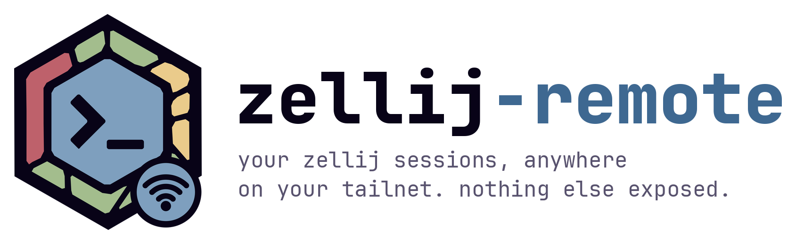
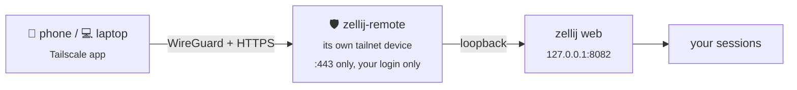
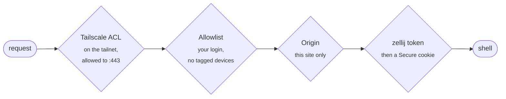

<p align="center">
  <picture>
    <source media="(prefers-color-scheme: dark)" srcset="docs/banner-dark.png">
    
  </picture>
</p>

<p align="center">
  <a href="https://github.com/pa/zellij-remote/actions/workflows/ci.yml"></a>
  
  
  
  <a href="LICENSE"></a>
</p>

<p align="center">
  Open your <a href="https://zellij.dev">zellij</a> sessions remotely, from your phone or another laptop, over <a href="https://tailscale.com">Tailscale</a>.<br>
  One binary, one port, only you.
</p>

---

## How it works



zellij-remote has Tailscale built in ([tsnet](https://tailscale.com/kb/1244/tsnet)). It
joins your tailnet as its own device, `zellij-<name>.<tailnet>.ts.net`,
and passes HTTPS through to zellij's
[web client](https://zellij.dev/documentation/web-client).

| What you get | How |
|---|---|
| 🔌 **One port** | The device answers on 443 only. SSH, file sharing and dev servers stay unreachable. No VPN interface, no routes. |
| 🔒 **Encrypted end to end** | WireGuard, with HTTPS inside it. TLS ends inside zellij-remote. |
| 👤 **Only you** | Every request is checked against your Tailscale login, even if your ACLs allow more. |
| ⚙️ **One program** | It starts `zellij web` itself and runs at login (launchd or systemd). |
| 🙅 **No Tailscale app on the machine** | Only the devices you connect *from* need it. |

## Quick start

```bash
go install github.com/pa/zellij-remote/cmd/zellij-remote@latest   # or a binary from Releases
zellij-remote setup --name mac --allow you@example.com             # join the tailnet, get a login token
zellij-remote start                                                # run in the background
# in each zellij session you want in the browser: Ctrl o, then s → share
```

Then open `https://zellij-mac.<tailnet>.ts.net` on your phone, with the
Tailscale app on, and paste the token. First time? Prepare the tailnet once
(step 1).

---

## 1. Prepare the tailnet (once)

> `zellij-remote setup` walks you through this too. All three steps are in
> the [admin console](https://console.tailscale.com/admin), as an Owner or
> Admin, **in this order**.

| Step | Where | Do this |
|---|---|---|
| **1a** | [DNS](https://console.tailscale.com/admin/dns) | Enable **MagicDNS**, then **HTTPS Certificates** |
| **1b** | [Access controls](https://console.tailscale.com/admin/acls) | Add the tag and the grant below (JSON editor) |
| **1c** | [Settings › Keys](https://console.tailscale.com/admin/settings/keys) | **Generate auth key** with the settings below |

**1b: tag and grant.** Add these next to your existing entries:

```json
{
  "tagOwners": { "tag:zellij": ["autogroup:admin"] },
  "grants": [
    { "src": ["you@example.com"], "dst": ["tag:zellij"], "ip": ["tcp:443"] }
  ]
}
```

`src` (and `--allow` later) is **your Tailscale login, not a URL**. Copy it
from [Users](https://console.tailscale.com/admin/users):

| You sign in with | Your login looks like |
|---|---|
| Google, Microsoft, Okta, email | `you@yourdomain.com` |
| GitHub | `<github-username>@github` |
| Passkey | `<name>@passkey` |

**1c: auth key settings**

| Reusable | Expiration | Ephemeral | Tags | Pre-approved |
|:-:|:-:|:-:|:-:|:-:|
| off | 1 day | off | `tag:zellij` | on, if shown |

Copy the key (`tskey-auth-…`). It's shown once.

<details>
<summary><b>Why these settings, and what to watch for</b></summary>

- **Certificates are public.** Every HTTPS certificate goes into
  Certificate Transparency logs, so `zellij-<name>` and your tailnet's name
  become public. Pick a `--name` that says nothing sensitive.
- **Grant only yourself.** A zellij login is a shell on the machine. Don't
  use `autogroup:member`.
- **Allow-all policies.** A new tailnet's default policy lets every device
  reach every port. While that rule is there, the grant adds nothing. The
  zellij-remote allowlist still protects you, but consider replacing
  allow-all with rules for what you use.
- **The tag matters.** zellij-remote requests `tag:zellij` itself and won't
  run without it. That works only if `tagOwners` lists the tag.
- **Not ephemeral.** An ephemeral device disappears whenever the machine
  sleeps. Tagged devices never expire.
- **The tagged device can't reach your other devices.** No rule above
  allows it.

</details>

## 2. Set up the machine

```bash
zellij-remote setup --name mac --allow you@example.com
zellij-remote start
```

| `setup` | What it does |
|---|---|
| 🔑 Asks for the auth key | Hidden input, or `TS_AUTHKEY`, or a pipe. Never saved, never logged. |
| 🌐 Joins the tailnet | Fetches the HTTPS certificate and prints your URL |
| 🎟️ Prints a login token **once** | zellij keeps only a hash, zellij-remote keeps nothing. Put it in a password manager, then clear your scrollback. |

| Command | What it does |
|---|---|
| `zellij-remote start` | Install and start the background service (at login, restarts on a crash) |
| `zellij-remote status` | Running?, URL, allowlist, last log lines |
| `zellij-remote stop` | Stop it, and remove it from login |
| `zellij-remote token` | Another login token |
| `zellij-remote token --read-only` | A token that can only watch |
| `zellij-remote upgrade` | Install the latest release (see Upgrading below) |
| `zellij-remote run` | Run in the foreground instead, under your own supervisor |

<details>
<summary><b>More: re-running setup, ports, Linux</b></summary>

- **Running setup again** keeps the device name, which is part of the URL.
  Pass `--allow` to change the allowlist, then `zellij-remote start` again
  to apply it.
- **`--port`** moves zellij web off 8082.
- **An existing `zellij web`** on that port gets used as is, but isn't
  restarted if it stops. Run `zellij web --stop` before `start` to hand it
  over.
- **Linux:** systemd stops user services when you log out, SSH included.
  Keep it running with `loginctl enable-linger $USER`.

</details>

## 3. Share your sessions

zellij lists a session in the browser **only after you share it**, and
none are shared by default.

| To share | Do this |
|---|---|
| **One session** (safer) | In the session press **Ctrl o**, then **s**, and turn sharing on. Do it again to turn it off. |
| **Every new session** | Add `web_sharing "on"` to `~/.config/zellij/config.kdl`. Running sessions keep their setting. |

<details>
<summary><b>All <code>web_sharing</code> values</b></summary>

| Value | Effect |
|---|---|
| `"off"` (default) | Nothing is shared until a session opts in |
| `"on"` | Every new session is shared |
| `"disabled"` | Nothing can be shared, and sessions can't opt in |

Sharing one session at a time keeps a session you didn't mean to expose,
like one with production credentials loaded, out of the browser.

</details>

## 4. Open it

1. **Install Tailscale** on the device you'll use:
   [iPhone/iPad](https://apps.apple.com/app/tailscale/id1470499037) ·
   [Android](https://play.google.com/store/apps/details?id=com.tailscale.ipn) ·
   [macOS, Windows, Linux](https://tailscale.com/download)
2. **Sign in as yourself**, with the login from `--allow`, and switch it on.
   Don't use the auth key, and don't tag this device.
3. **Open your URL** and paste the token.

`/` lists your shared sessions. `/<name>` attaches to a session, or creates
it.

## ⬆️ Upgrading

When a newer release is out, any `zellij-remote` command ends with:

```
zellij-remote v1.2.0 is available (this is v1.1.0). Run `zellij-remote upgrade`.
```

| Command | What it does |
|---|---|
| `zellij-remote upgrade` | Downloads the release for your OS and CPU, checks its SHA-256 against the release's `checksums.txt`, swaps the binary in one atomic rename, and restarts the background service |
| `zellij-remote upgrade --check` | Only says whether there's a newer release |

<details>
<summary><b>How the check works</b></summary>

- **Once a day at most.** A command asks GitHub only if the last answer is
  over a day old, and gives up after 2 seconds. The running service also
  checks daily and writes the notice to its log. Failed checks back off
  for a day too.
- **Anonymous.** Requests carry no GitHub credentials.
- **Never installs by itself.** Nothing changes until you run `upgrade`.
- **Built from source?** Development builds are never notified, and
  `upgrade` replaces one only with `--force`.
- **Turn it off** with `ZELLIJ_REMOTE_NO_UPDATE_CHECK=1`.
- **What the checksum proves:** the download arrived intact. It comes from
  the same release as the binary, so it doesn't vouch for the release
  itself.

</details>

## 📱 On your phone

zellij's web client switches to a touch interface on phones, with pane and
tab pickers, a fit toggle and an extra key bar.

| Gesture | What it does |
|---|---|
| Swipe up / down | Scroll the terminal |
| Tap | Click (focus a pane, press a button) |
| **Two-finger tap** | **Switch keyboard mode on or off** |
| Pinch | Change the font size |

> **Keyboard pops up every time you scroll?** Keyboard mode is on. While
> it's on, zellij refocuses its input on every touch to keep the keyboard
> open, and that includes the first touch of a scroll. **Two-finger tap**
> to switch it off, scroll freely, and two-finger tap again to type. This
> is zellij's own behavior; zellij-remote passes the page through
> unchanged.

## Troubleshooting

<details>
<summary><b>The URL times out</b></summary>

Check these in order. The log (`zellij-remote status`) records every
request that reaches the machine; if it shows nothing, the request never
arrived, so look at 2–4.

1. `zellij-remote status` shows it running. `setup` only joins; `start`
   serves.
2. The Tailscale app on your device is on, and on the same tailnet.
3. Under **Machines**, the device has `tag:zellij`. If not, fix `tagOwners`
   (1b), or add the tag by hand (**…** › **Edit ACL tags**), then run
   `zellij-remote start`.
4. The grant: `src` is your login exactly as **Users** shows it,
   `dst: tag:zellij`, `ip: tcp:443`.

</details>

<details>
<summary><b>403 Forbidden</b></summary>

| Log says | Meaning |
|---|---|
| `isn't on the allowlist` | Your device is signed in to Tailscale as someone not on `--allow` |
| `tagged devices aren't allowed` | Your phone or laptop has a tag. Sign it in as you, untagged. |
| `Origin … isn't …` | A page from another site tried to reach zellij. Working as intended. |

</details>

<details>
<summary><b>"Unauthorized or revoked login token"</b></summary>

The token was mistyped or revoked. Run `zellij-remote token` for a new one.

</details>

<details>
<summary><b>Sessions don't show up</b></summary>

- **Share them** (step 3): **Ctrl o**, then **s**, in each session.
- **Same user:** zellij web sees only the sessions of the user it runs
  as, through zellij's socket directory under `$TMPDIR`.

</details>

<details>
<summary><b>"already running" in the log, or the service keeps restarting</b></summary>

A `zellij-remote run` in a terminal holds the tailnet identity. `status`
shows it as `foreground: … pid N`. Stop it, and the service takes over
automatically.

</details>

## 🔐 Security



| Layer | Protection |
|---|---|
| **Encryption** | WireGuard, with HTTPS inside it, from your device to the zellij-remote process. The hop to zellij web is loopback only. The zellij token is a login, not an encryption key. |
| **Identity** | zellij-remote asks the tailnet who's connecting, from its coordination data rather than anything the client sends. Logins not on `--allow` and tagged devices get a 403 before reaching zellij. |
| **Origin** | zellij 0.45 doesn't check `Origin` on its WebSockets, and `SameSite=Strict` treats every `*.<tailnet>.ts.net` host as one site. zellij-remote refuses foreign origins, so another tailnet page can't open a terminal through your browser. |
| **Cookies** | zellij's session cookie gets `Secure`, and every response gets HSTS. |
| **Audit log** | Logins, terminals opened and refusals (who, from where) go to `~/.zellij-remote/zellij-remote.log`, mode 0600. Headers, cookies, tokens and query strings are never logged. |
| **Secrets** | The auth key and tokens are never stored. A pre-commit hook and CI scan keep them out of git. |

<details>
<summary><b>Handling tokens</b></summary>

- **A full token is a shell.** Whoever holds one runs commands as you, and
  `/<any-name>` creates sessions. Use `zellij-remote token --read-only` for
  devices that only watch.
- **Revoke** what you don't use:
  `zellij web --list-tokens`, then `zellij web --revoke-token <name>` (or
  `--revoke-all-tokens`).
- **Shared machines:** other local users can reach `127.0.0.1:8082`
  directly, skipping the allowlist (they'd still need a token). Prefer
  single-user machines.

</details>

<details>
<summary><b>Keeping it private</b></summary>

- **Never put it behind [Funnel](https://tailscale.com/kb/1223/funnel).**
  zellij's login has no rate limiting.
- **Cut it off** by removing the device under **Machines**. To start over:
  `zellij-remote stop`, delete `~/.zellij-remote/tailscale`, get a new key,
  and run setup again.
- **[Tailnet Lock](https://tailscale.com/kb/1226/tailnet-lock)** stops even
  Tailscale's coordination server from adding devices without your
  signature.
- **Certificate logs** make the device and tailnet names public (1a).

</details>

<details>
<summary><b>Files</b></summary>

| Path | What |
|---|---|
| `~/.zellij-remote/` | All state, mode 0700. Move it with `ZELLIJ_REMOTE_HOME`. |
| `├── config.json` | Name, device name, URL, port, allowlist (0600) |
| `├── tailscale/` | The device's tailnet identity, its private key included |
| `└── zellij-remote.log` | The service log, zellij web's output included (0600) |
| `~/Library/LaunchAgents/com.github.pa.zellij-remote.plist` | macOS service |
| `~/.config/systemd/user/zellij-remote.service` | Linux service |

No tokens or keys are stored anywhere in it.

</details>

---

## 🛠️ Build from source

Go 1.27.1+ and git. No C toolchain needed.

```bash
git clone https://github.com/pa/zellij-remote.git && cd zellij-remote
git config core.hooksPath .githooks                  # secret scan on every commit
go build -o bin/zellij-remote ./cmd/zellij-remote    # or: go install ./cmd/zellij-remote
```

<details>
<summary><b>Versioned builds, cross-compiling, rebuilding the service</b></summary>

```bash
# stamped with a version
go build -trimpath -ldflags "-s -w -X main.version=$(git describe --tags --always --dirty)" \
  -o bin/zellij-remote ./cmd/zellij-remote

# for another machine: darwin/arm64, darwin/amd64, linux/amd64, linux/arm64
CGO_ENABLED=0 GOOS=linux GOARCH=arm64 go build -o bin/zellij-remote-linux-arm64 ./cmd/zellij-remote
```

The service records the binary's path. After rebuilding, run
`zellij-remote start` again to pick up the new build. `start` refuses a
`go run` binary, because `go run` deletes it on exit.

</details>

## 🧪 Local testing

| Level | Tests | Needs | Time |
|:-:|---|---|---|
| **1** | Unit tests: proxy, allowlist, Origin, service files, supervisor | nothing | seconds |
| **2** | The proxy driving a real `zellij web` over TLS | zellij | a minute |
| **3** | End to end on your tailnet, sandboxed | an auth key, a phone | 10 min |
| **4** | The background service: start, crash recovery, stop | your real install | 5 min |

<details>
<summary><b>Level 1: unit tests</b></summary>

```bash
gofmt -l . && go vet ./... && GOOS=linux go vet ./...
go test -race ./...
scripts/check-secrets.sh --history
```

</details>

<details>
<summary><b>Level 2: against a real zellij</b></summary>

The test logs in, opens a session, checks that a cross-origin WebSocket is
refused, and reads terminal output. The token stays in a shell variable,
never on screen or in your history.

```bash
zellij web --port 18082 &
out=$(zellij web --create-token | grep '^token_')
ZELLIJ_IT_URL=http://127.0.0.1:18082 ZELLIJ_IT_TOKEN="${out#*: }" \
  go test ./internal/proxy -run RealZellij -count=1 -v
zellij web --revoke-token "${out%%:*}"; unset out
zellij delete-session --force zellij-remote-it
kill %1
```

</details>

<details>
<summary><b>Level 3: end to end on your tailnet</b></summary>

A throwaway instance with its own state, name and port, so it doesn't
touch your real install. Each sandbox needs a new auth key.

```bash
export ZELLIJ_REMOTE_HOME=$(mktemp -d)
./bin/zellij-remote setup --name dev-test --port 18083 --allow you@example.com
./bin/zellij-remote run       # Ctrl-C stops it and its zellij web
```

Share a session (step 3), then from your phone:

- [ ] The URL loads over HTTPS, and the token logs in
- [ ] Typing echoes back (the WebSocket works through the proxy)
- [ ] `/<new-name>` creates a session
- [ ] The log shows `login attempt by …` and `terminal opened by …`
- [ ] `curl -s -o /dev/null -w '%{http_code}\n' -H 'Origin: https://evil.example' <url>` prints `403`
- [ ] With `--allow someone-else@example.com`, you get a 403 and `isn't on the allowlist`
- [ ] `nc -vz zellij-dev-test.<tailnet>.ts.net 22` fails (only 443 answers)

Clean up: revoke the token (`zellij web --list-tokens`,
`--revoke-token <name>`), run `rm -rf "$ZELLIJ_REMOTE_HOME"`, and remove
the device under **Machines**.

</details>

<details>
<summary><b>Level 4: the background service</b></summary>

There's one service per user, and `start` replaces it, so use your real
install.

```bash
zellij-remote start && zellij-remote status
pkill -f 'zellij web --ip 127.0.0.1'; sleep 3;  zellij-remote status   # zellij web is back
pkill -f 'zellij-remote run';         sleep 15; zellij-remote status   # the service is back
zellij-remote stop && zellij-remote status                            # not installed
```

| Platform | Inspect with |
|---|---|
| macOS | `launchctl print gui/$(id -u)/com.github.pa.zellij-remote` |
| Linux | `systemctl --user status zellij-remote`, `journalctl --user -u zellij-remote` |
| Linux from a Mac | A VM with systemd: [Lima](https://lima-vm.io), [OrbStack](https://orbstack.dev), [Multipass](https://multipass.run). Containers usually lack a user systemd. |

</details>

## 🤝 Contributing

Open a PR against `main`. The template asks what you tested and walks
through a security checklist. **CI runs on every PR:**

| Check | What it covers |
|---|---|
| 🔍 Secrets | Every commit in the history is scanned |
| 🧹 Lint | gofmt, vet (Linux and macOS), tidy modules, shellcheck |
| 🧪 Tests | `go test -race` on Ubuntu and macOS |
| 🖥️ Real zellij | The proxy against zellij 0.45.1 (checksum-pinned) |
| 📦 Builds | darwin and linux × amd64 and arm64 |
| 🛡️ govulncheck | Known vulnerabilities in code it calls |
| ✅ `ci-ok` | Passes only if everything above does |

Actions are pinned to commit SHAs, and Dependabot proposes updates weekly.
Levels 3 and 4 can't run in CI; the PR template says when to run them.

> **Secrets:** tests that need a token-shaped string use
> `00000000-0000-4000-8000-000000000000`. Never commit a real token, even
> briefly.

## License

[MIT](LICENSE)
