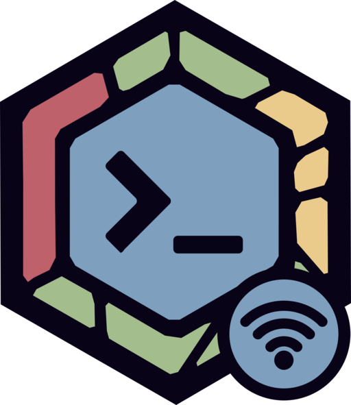

<p align="center">
  
</p>

<h1 align="center">zellij-remote</h1>

<p align="center">
  Your <a href="https://zellij.dev">zellij</a> sessions in a browser, on any device in your tailnet.
  <br>Nothing else on the machine becomes reachable.
</p>

---

`zellij-remote` is one Go binary. It puts
[zellij's web client](https://zellij.dev/documentation/web-client.html) on
your [Tailscale](https://tailscale.com) tailnet at
`https://zellij-<name>.<tailnet>.ts.net`. Open that address from your phone
or another laptop, log in with a zellij token, and you're in your sessions.

```
 phone / laptop ══WireGuard══▶ zellij-remote ──loopback──▶ zellij web
 (Tailscale app)   + HTTPS     its own tailnet device,      127.0.0.1:8082
                               :443 only, allowlisted       (started and kept
                               logins only                   running by zellij-remote)
```

The machine running zellij doesn't need the Tailscale app. `zellij-remote`
embeds Tailscale's Go library, [tsnet](https://tailscale.com/kb/1244/tsnet),
and joins the tailnet as a device of its own.

- **One port.** The device answers on 443 and nothing else. SSH, file
  sharing and dev servers on the machine stay unreachable from the tailnet.
  There's no VPN interface and no routes.
- **Real HTTPS.** TLS uses the device's `*.ts.net` certificate and ends
  inside `zellij-remote`. zellij itself stays on `127.0.0.1` over plain
  HTTP, where it needs no certificate.
- **Only you.** Every request is checked against the tailnet's own record
  of who sent it. Logins not on your allowlist, and tagged devices, get a
  403 before anything reaches zellij, even if your ACLs allow more.
- **One program to run.** zellij-remote starts `zellij web` itself and
  restarts it if it crashes. `zellij-remote start` runs the lot at login,
  under launchd on macOS or systemd `--user` on Linux.
- **Runs as you**, not root.

Supported on macOS and Linux. Needs zellij 0.43 or newer (tested with
0.45.1).

## Install

From source, with Go 1.27.1 or newer:

```bash
go install github.com/pa/zellij-remote/cmd/zellij-remote@latest
```

Or download a binary for your platform from
[Releases](https://github.com/pa/zellij-remote/releases), unpack it, and put
`zellij-remote` on your `PATH`.

Or [build it from source](#build-from-source).

## 1. Prepare the tailnet (once)

`zellij-remote setup` walks you through these steps in the terminal, so you
can follow along there instead.

All three are in the [Tailscale admin console](https://console.tailscale.com/admin)
and need an Owner or Admin of the tailnet. Do them in this order, because
the auth key's tag has to exist before you can create the key.

### 1a. Turn on MagicDNS and HTTPS certificates

1. Open **DNS** ([console.tailscale.com/admin/dns](https://console.tailscale.com/admin/dns)).
2. If MagicDNS is off, select **Enable MagicDNS**.
3. Under **HTTPS Certificates**, select **Enable HTTPS** and accept the notice.

**Every HTTPS certificate is recorded in public Certificate Transparency
logs.** So the device name `zellij-<name>` and your tailnet's name become
public. Pick a `--name` in step 2 that says nothing sensitive.

### 1b. Add the tag, and who can reach it

Open **Access controls**
([console.tailscale.com/admin/acls](https://console.tailscale.com/admin/acls)),
switch to the JSON editor, and add these next to your existing entries:

```json
{
  "tagOwners": {
    "tag:zellij": ["autogroup:admin"]
  },
  "grants": [
    {
      "src": ["you@example.com"],
      "dst": ["tag:zellij"],
      "ip":  ["tcp:443"]
    }
  ]
}
```

- Put your own Tailscale login in `src`. A zellij login is a shell on the
  machine, so grant it to yourself only, not to `autogroup:member`.
  It's not a URL: it's the account you sign in to Tailscale with. Copy
  it exactly from **Users**
  ([console.tailscale.com/admin/users](https://console.tailscale.com/admin/users)):

  | You sign in with | Your login |
  |---|---|
  | Google, Microsoft, Okta, email | your email, `you@yourdomain.com` |
  | GitHub | `<github-username>@github` |
  | Passkey | `<name>@passkey` |

  The same login goes into `zellij-remote setup --allow`.
- A new tailnet's default policy lets every device reach every other on
  every port. While that allow-all rule is there, the grant above changes
  nothing. To actually restrict access, replace the allow-all rule with
  rules for what you use.
- The tagged device can't reach any of your other devices unless a rule
  says so. Nothing above does.

### 1c. Create the auth key

Open **Settings › Keys**
([console.tailscale.com/admin/settings/keys](https://console.tailscale.com/admin/settings/keys)),
select **Generate auth key**, and set:

| Setting      | Value                                                         |
|--------------|---------------------------------------------------------------|
| Reusable     | off: one key, one device                                      |
| Expiration   | 1 day: it's only needed for setup                             |
| Ephemeral    | off: an ephemeral device vanishes whenever the machine sleeps |
| Tags         | on, `tag:zellij` (missing from the list? 1b wasn't saved)     |
| Pre-approved | on, if it's shown                                             |

Copy the key (`tskey-auth-…`). It's shown only once.

Tagged devices belong to the tailnet rather than to a person, so their
node key doesn't expire.

## 2. Set up the machine

```bash
zellij-remote setup --name "my laptop" --allow you@example.com
zellij-remote start
```

That's all. `setup`:

1. Asks for the auth key. Input is hidden; `TS_AUTHKEY` or a pipe works
   too. The key is never saved, never logged, and never passed on a command
   line.
2. Joins the tailnet, fetches the HTTPS certificate, and prints the URL.
3. Creates a zellij login token and prints it **once**. zellij keeps only a
   hash of it, and zellij-remote doesn't keep it at all. Put it in your
   password manager, then clear your terminal's scrollback.

`--allow` takes your Tailscale login, the same one as `src` in 1b
(comma-separate several). Only those people's own devices get through.
Without it, setup asks.

`start` installs one background service that runs at login and restarts on
a crash. It starts `zellij web` on 127.0.0.1 itself. If you already run a
`zellij web` on that port, zellij-remote uses yours, but won't restart it if
it stops; `zellij web --stop` before `start` hands it over.

```bash
zellij-remote status              # running?, URL, allowlist, last log lines
zellij-remote stop                # stop, and remove from login
zellij-remote token               # another login token
zellij-remote token --read-only   # a token that can only watch sessions
```

The device name is part of the URL, so running setup again keeps the name
it already has. Running it again with `--allow` changes the allowlist
(restart with `zellij-remote start` to apply). `--port` moves zellij web
off the default 8082.

**Linux:** systemd stops user services when your last session ends, SSH
sessions included. To keep zellij-remote running after you log out, turn on
lingering once:

```bash
loginctl enable-linger $USER
```

To run it under a supervisor of your own instead, use `zellij-remote run`,
which does the same in the foreground.

## 3. Share your sessions

zellij lists a session in the web client only after that session is
shared, and by default (`web_sharing "off"`) none are. Without this step
you can log in, but your sessions won't show up.

**Share one session.** Do this in each session you want in the browser:

1. In the session, press **Ctrl o** to enter Session mode.
2. Press **s** to open the **Share** plugin, a floating pane.
3. Turn sharing on for this session, then close the pane.

To stop sharing, open the Share plugin again and turn it off.

**Share new sessions automatically.** Set this in
`~/.config/zellij/config.kdl`:

```kdl
web_sharing "on"
```

New sessions are shared from the start. Sessions that are already running
keep their setting, so share those with the Share plugin, or restart them.

| `web_sharing` | Effect |
|---|---|
| `"off"` (default) | Nothing is shared until a session opts in with the Share plugin |
| `"on"` | Every new session is shared |
| `"disabled"` | Nothing can be shared, and the Share plugin can't change that |

Sharing one session at a time is the safer habit. It keeps a session you
didn't mean to expose, like one with production credentials loaded, out
of the browser.

## 4. Open it

On your phone or another computer:

1. Install the Tailscale app and sign in to the same tailnet **as
   yourself**. Don't use the auth key from 1c, and don't tag the device:
   a tagged device no longer counts as you, and the grant won't let it in.
2. Open the URL that `setup` printed, and paste the login token.

`/` lists your shared sessions; pick one to attach. `/<name>` attaches to
a session, or creates it if it doesn't exist yet.

## Troubleshooting

**The URL times out.** Check these, in order:

1. `zellij-remote status` must show it running. `setup` only joins the
   tailnet; nothing serves the URL until `start` (or `run`).
2. The Tailscale app on your device must be on and signed in to the
   same tailnet.
3. The device must be tagged `tag:zellij` under **Machines**. zellij-remote
   requests the tag itself and refuses to run without it, but the request
   only succeeds if `tagOwners` lists the tag (1b). If the device shows no
   tag, fix `tagOwners` or add the tag by hand (**…** > **Edit ACL tags**),
   then run `zellij-remote start` again.
4. The grant in 1b: `src` must be your login exactly as **Users** shows
   it, `dst` must be `tag:zellij`, and `ip` must be `tcp:443`.

When a request reaches the machine, the log says so (`zellij-remote
status` shows the last lines). If the log shows nothing, the request never
arrived, so the problem is in 2–4.

**403 Forbidden.** The log says why. `isn't on the allowlist` means your
device is signed in to Tailscale as someone not on `--allow`. `tagged
devices aren't allowed` means your phone or laptop has a tag; it must be
signed in as you, untagged.

**"Unauthorized or revoked login token".** The token was mistyped or
revoked. Make a new one with `zellij-remote token`.

**Your sessions don't show up.** Share them first (step 3): **Ctrl o**,
then **s**, in each session. zellij shares none by default.

If a shared session still doesn't appear, check the user: zellij web sees the sessions of the user
it runs as, through zellij's socket directory under `$TMPDIR`. Run
zellij-remote as the same user as your sessions. zellij-remote starts
zellij web without the `ZELLIJ_SESSION_NAME` that a zellij pane sets;
inherited, it would make zellij treat that session as "current" and hide
it.

## Security

### What's encrypted

| Hop | Protection |
|---|---|
| your device → this machine | WireGuard (Tailscale), and inside it HTTPS with the device's `*.ts.net` certificate. TLS ends inside the zellij-remote process; Tailscale's servers never see plaintext. |
| zellij-remote → zellij web | plain HTTP over loopback (`127.0.0.1`). It never leaves the machine. |

The zellij token doesn't encrypt anything. It's a login credential:
zellij exchanges it for a session cookie, and the encryption above
protects both.

### Who gets in

A request has to pass all of these, in order:

1. **Tailscale ACLs:** your device must be on the tailnet and allowed to
   reach `tag:zellij` on 443.
2. **The allowlist:** zellij-remote asks the tailnet who is connecting
   (from its own coordination data, not anything the client sends). It
   refuses logins not on `--allow` and tagged devices. This holds even if
   your ACL is the default allow-all.
3. **The Origin check:** a request whose `Origin` isn't zellij-remote's own
   URL gets a 403. zellij 0.45 doesn't check `Origin` on its WebSockets,
   and its `SameSite=Strict` cookie counts every `*.<tailnet>.ts.net`
   host as the same site. Without this check, a page served by another
   device on your tailnet could open a terminal using your logged-in
   browser.
4. **A zellij login token.** Then zellij's session cookie, which
   zellij-remote marks `Secure`, with HSTS on every response.

Refusals, login attempts, and every terminal opened (who, from where) go to
`~/.zellij-remote/zellij-remote.log`, which is mode 0600. Headers, cookies,
tokens and query strings are never logged.

### Handling tokens

- **A full token is a shell on this machine.** Whoever holds one can run
  commands as you, and visiting `/<any-name>` creates a new session. Keep
  tokens in a password manager. Give a device that only needs to watch a
  `zellij-remote token --read-only` token.
- Tokens are printed once and stored nowhere by zellij-remote; zellij
  stores only a hash. Revoke ones you no longer need:
  ```bash
  zellij web --list-tokens
  zellij web --revoke-token <name>      # or --revoke-all-tokens
  ```
- On a shared machine, other local users can reach `127.0.0.1:8082`
  directly, skipping the allowlist (they'd still need a token). zellij web
  can't listen on a unix socket, so use zellij-remote on single-user
  machines.

### Keeping it private

- **Not on the public internet.** Don't put this behind
  [Funnel](https://tailscale.com/kb/1223/funnel). zellij's login has no
  rate limiting.
- **Cut it off** by removing the device under **Machines** in the admin
  console. To start over, run `zellij-remote stop`, delete
  `~/.zellij-remote/tailscale`, generate a new key, and run setup again.
- [Tailnet Lock](https://tailscale.com/kb/1226/tailnet-lock) requires every
  new device to be signed by one of your trusted devices before it can
  join. That stops Tailscale's coordination server from adding a device on
  its own.
- The device name and your tailnet's name are public through Certificate
  Transparency logs (see 1a).

## Files

| Path | What |
|---|---|
| `~/.zellij-remote/` | all state, mode 0700 |
| `~/.zellij-remote/config.json` | name, device name, URL, port, allowlist (0600) |
| `~/.zellij-remote/tailscale/` | the device's tailnet identity, its private key included |
| `~/.zellij-remote/zellij-remote.log` | the service's log, zellij web's output included (0600) |
| `~/Library/LaunchAgents/com.github.pa.zellij-remote.plist` | macOS |
| `~/.config/systemd/user/zellij-remote.service` | Linux |

No tokens or keys are stored anywhere in it.

`ZELLIJ_REMOTE_HOME` moves `~/.zellij-remote` elsewhere.

## Build from source

You need Go 1.27.1 or newer (`go version`) and git. Linux builds need no C
toolchain.

```bash
git clone https://github.com/pa/zellij-remote.git
cd zellij-remote
git config core.hooksPath .githooks       # scan every commit for secrets (see below)

go build -o bin/zellij-remote ./cmd/zellij-remote
./bin/zellij-remote version               # zellij-remote dev
```

To put it on your `PATH` (in `$(go env GOPATH)/bin`):

```bash
go install ./cmd/zellij-remote
```

A release-style build, stamped with a version:

```bash
go build -trimpath -ldflags "-s -w -X main.version=$(git describe --tags --always --dirty)" \
  -o bin/zellij-remote ./cmd/zellij-remote
```

To build for another machine, for example a Linux server, set `GOOS` and
`GOARCH`. The four release targets are darwin/arm64, darwin/amd64,
linux/amd64 and linux/arm64.

```bash
CGO_ENABLED=0 GOOS=linux GOARCH=arm64 go build -o bin/zellij-remote-linux-arm64 ./cmd/zellij-remote
```

`zellij-remote start` refuses to run from `go run`, because that binary is
deleted when `go run` exits. The service records the binary's path, so
after rebuilding the same path, run `zellij-remote start` again to pick up
the new build.

## Local testing

There are four levels. Each builds on the one before, and only the third
needs a Tailscale auth key.

### 1. Unit tests (seconds, nothing else needed)

```bash
gofmt -l .                 # prints nothing when formatting is clean
go vet ./...
GOOS=linux go vet ./...    # the Linux code paths, from a Mac
go test -race ./...
scripts/check-secrets.sh --history
```

These cover the proxy (forwarding, WebSocket passthrough, the Origin and
allowlist checks, the `Secure` cookie, HSTS), the launchd and systemd unit
files, the zellij web supervisor (restart, clean stop, stale-process
cleanup), the allowlist, token parsing and config. CI runs the same on
Linux and macOS.

### 2. Against a real zellij, without Tailscale (a minute)

This test drives a real `zellij web` through the proxy over TLS, the way a
browser would. It logs in with a token, opens a session, checks that a
cross-origin WebSocket is refused, and reads terminal output over the
WebSocket. It uses a throwaway zellij web on port 18082 and a token that
stays in a shell variable, never on screen or in your shell history.

```bash
zellij web --port 18082 &
out=$(zellij web --create-token | grep '^token_')
ZELLIJ_IT_URL=http://127.0.0.1:18082 ZELLIJ_IT_TOKEN="${out#*: }" \
  go test ./internal/proxy -run RealZellij -count=1 -v
zellij web --revoke-token "${out%%:*}"; unset out
zellij delete-session --force zellij-remote-it
kill %1
```

Without `ZELLIJ_IT_URL` and `ZELLIJ_IT_TOKEN`, `go test` skips it.

### 3. End to end on your tailnet, sandboxed

This runs a second, throwaway zellij-remote in the foreground. It has its
own state directory, device name and port, so it leaves a real install
alone. Prepare the tailnet first (step 1 above). Each sandbox needs a new
single-use auth key.

```bash
export ZELLIJ_REMOTE_HOME=$(mktemp -d)    # all state goes here, not ~/.zellij-remote
./bin/zellij-remote setup --name dev-test --port 18083 --allow you@example.com
./bin/zellij-remote run                   # logs to the terminal; Ctrl-C stops it and its zellij web
```

`setup` prints the URL (`https://zellij-dev-test.<tailnet>.ts.net`) and a
login token. Share a session (step 3). Then, from your phone or another tailnet
device:

- [ ] The URL loads over HTTPS, and the login page appears.
- [ ] The token logs in. Typing in a session echoes back (the WebSocket
      works through the proxy).
- [ ] `/<new-name>` creates a session; `zellij list-sessions` shows it.
- [ ] The terminal running `run` logs `login attempt by …` and
      `terminal opened by …` with your login.
- [ ] A cross-origin request is refused:
      `curl -s -o /dev/null -w '%{http_code}\n' -H 'Origin: https://evil.example' https://zellij-dev-test.<tailnet>.ts.net/`
      prints 403.
- [ ] A login that isn't on `--allow` gets a 403, and `run` logs
      `refused … isn't on the allowlist`. To try it, run setup again with
      `--allow someone-else@example.com`, restart `run`, and reload.
- [ ] Only 443 answers: `nc -vz zellij-dev-test.<tailnet>.ts.net 22` fails.

To clean up:

```bash
zellij web --list-tokens && zellij web --revoke-token <name>   # the token setup printed
rm -rf "$ZELLIJ_REMOTE_HOME"; unset ZELLIJ_REMOTE_HOME
```

Then remove `zellij-dev-test` under **Machines** in the admin console.

### 4. The background service

There's only one service per user (`com.github.pa.zellij-remote` or
`zellij-remote.service`), and `start` replaces whatever is installed. So
test this with your real setup, not a sandbox.

```bash
go install ./cmd/zellij-remote
zellij-remote start
zellij-remote status          # service running, zellij web "started by zellij-remote"
pkill -f 'zellij web --ip 127.0.0.1'; sleep 3; zellij-remote status    # zellij web is back
pkill -f 'zellij-remote run';         sleep 15; zellij-remote status   # the service is back, new pid
zellij-remote stop && zellij-remote status                             # not installed
```

- **macOS:** `launchctl print gui/$(id -u)/com.github.pa.zellij-remote`
  shows what launchd thinks.
- **Linux:** `systemctl --user status zellij-remote` and
  `journalctl --user -u zellij-remote` (the log itself is in
  `~/.zellij-remote/zellij-remote.log`).
- **A Linux VM from a Mac:** [Lima](https://lima-vm.io),
  [OrbStack](https://orbstack.dev) and
  [Multipass](https://multipass.run) all run systemd. Cross-compile as
  above, copy the binary in, install zellij there, and run levels 3 and 4.
  Containers usually lack a systemd user instance, so use a VM.

### Secrets

`scripts/check-secrets.sh` refuses commits that contain anything shaped
like a Tailscale key, a zellij token or session cookie, or a private key.
It runs as the pre-commit hook (`git config core.hooksPath .githooks`),
and CI runs it over the whole history. A test that needs a token-shaped
string uses `00000000-0000-4000-8000-000000000000`. Never paste a real
token into a file in the repo, even briefly.

## License

MIT
